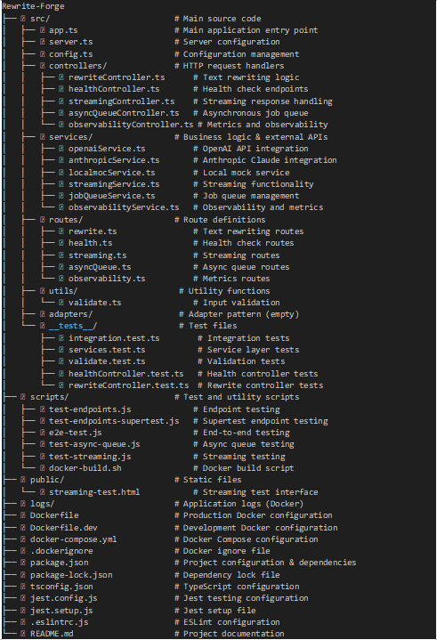

# RewriteForge Service

A lightweight text transformation service that converts plain text into different styles using LLM capabilities, with comprehensive observability and containerization support.

## Project Structure Image


## Features

- **Text Transformation**: Convert text to pirate, haiku, or formal styles
- **Multi-LLM Support**: OpenAI, Anthropic, and local mock services
- **Caching**: In-memory caching for identical requests with hit/miss metrics
- **REST API**: Clean HTTP interface with comprehensive endpoints
- **Health Checks**: Container-ready health endpoints
- **TypeScript**: Full type safety and modern development
- **Testing**: Comprehensive unit, integration, and E2E tests
- **Observability**: Request logging and cache hit/miss metrics
- **Containerization**: Production-ready Docker support with multi-stage builds
- **Development Tools**: Hot reload, debugging, and development containers

### Create .env file in the root directory

```bash
# RewriteForge Service Environment Configuration

# Server Configuration
PORT=3000

# OpenAI Configuration (Optional)
OPENAI_API_KEY=your_openai_api_key_here

# Anthropic Configuration (Optional)
ANTHROPIC_API_KEY=your_anthropic_api_key_here

# LLM Configuration
LLM_API_KEY=your_llm_api_key_here

# Environment
NODE_ENV=development
```

### Docker (Recommended)

```bash
# Build
sudo docker compose up --build
#Run
docker compose up
#Down
docker compose down


#### 1. Install Dependencies

```bash
npm install
```

### Start the Service

```bash
# Development mode (with auto-reload)
npm run dev

# Production mode
npm start
```

### Test the Service

```bash
# Run Async Queue Mode test
node scripts/test-async-queue.js

# Run streaming test
- one terminal
  npm run dev
- another terminal
  node scripts/test-streaming.js

# Run E2E test
node scripts/e2e-test.js

# Run observability tests
node scripts/test-endpoints-supertest.js

# Run unit tests
npm test
```

### Run Lint
```
npm run lint
```

## API Endpoints

### Quick check
```
  POST /v1/rewrite - Synchronous text rewriting
  POST /v1/rewrite/submit - Submit async job
  GET /v1/rewrite/result/:jobId - Get job result
  GET /v1/rewrite/queue/stats - Queue statistics
  POST /v1/rewrite/stream - Streaming text rewriting (SSE)
  POST /v1/rewrite/stream/mock - Mock streaming (SSE)
  GET /health - Health check
  GET /metrics/cache - Cache hit/miss metrics
  GET /metrics/requests - Request statistics
  GET /metrics/overview - Comprehensive metrics overview
  POST /metrics/reset - Reset all metrics

### See streaming UI using http://localhost:3000/public/streaming-test.html
```

### POST /v1/rewrite
Transform text into a new style.

**Request Body:**
```json
{
  "text": "Hello world",
  "style": "pirate",
  "llm": "openai"
}
```

**Response:**
```json
{
  "original": "Hello world",
  "rewritten": "Arr matey! Hello world be the finest words I've ever laid me eyes upon! Yo ho ho!",
  "style": "pirate",
  "llm": "openai"
}
```

**Supported Styles:**
- `pirate` - Pirate speak
- `haiku` - Haiku poetry format
- `formal` - Formal business language (default)

**Supported LLM Providers:**
- `openai` - OpenAI GPT models
- `anthropic` - Anthropic Claude models
- `localmoc` - Local mock service (default)

### POST /v1/rewrite/submit
```
Asyncronize data.
```
### Get /v1/rewrite/result/jobid
```
Get data submitted.
```

### GET /health
Health check endpoint for container probes.

**Response:**
```json
{
  "status": "ok"
}
```

## Observability Endpoints
```
GET /metrics/cache?service=openai(anthropic or localmoc)
Get cache hit/miss metrics for all services or a specific service.

**Query Parameters:**
Service(optional) - Specific service name (openai, anthropic, localmoc)

GET /metrics/requests?limit=50
Get request statistics and recent logs.

GET /metrics/overview
Get comprehensive overview of all metrics.

POST /metrics/reset
Reset all metrics (useful for testing).
```